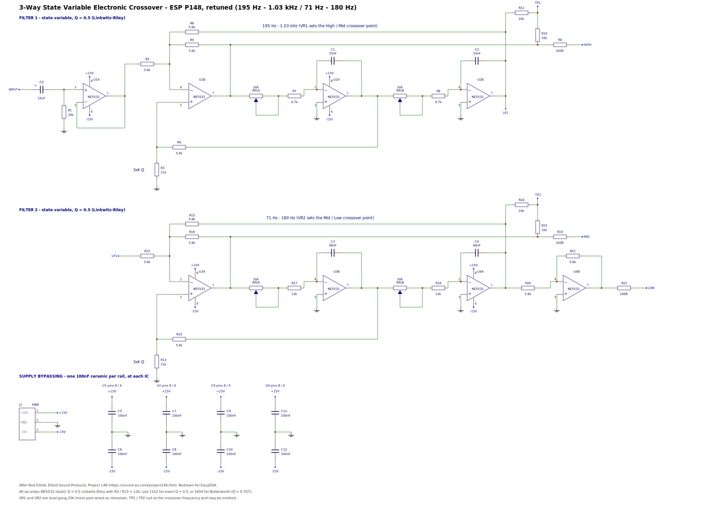
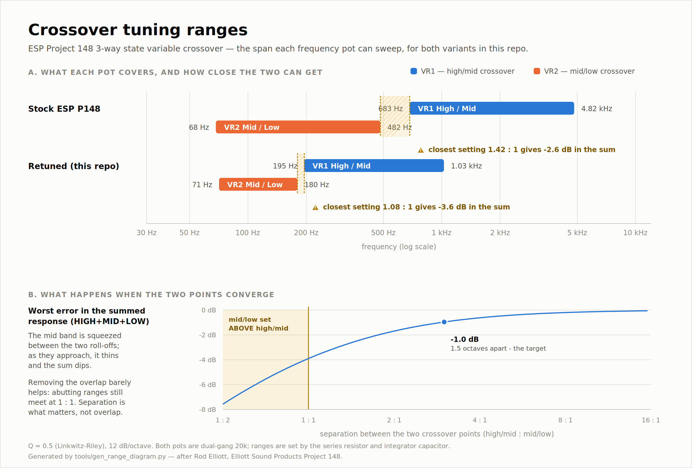
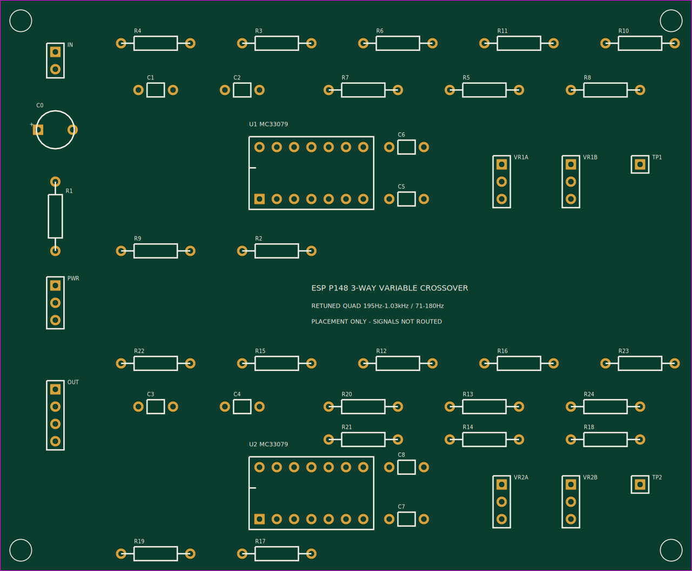

# Variable Crossover — ESP Project 148

An EasyEDA-importable schematic for the **3-way state variable electronic
crossover** from Elliott Sound Products Project 148
(<https://sound-au.com/project148.htm>), redrawn from Figure 2.

Two cascaded 2nd-order state variable filters, 12 dB/octave, with continuously
variable crossover frequencies and adjustable Q. One channel — build two for
stereo.

Two variants are provided. They are the **same circuit** — identical topology,
identical netlist — differing only in the six components that set the frequency
range:

| Variant | High/Mid | Mid/Low | Op-amps | File |
|---|---|---|---|---|
| Stock ESP P148 | 680 Hz – 4.8 kHz | 68 – 480 Hz | 4 × NE5532 dual | `esp-p148-3way-state-variable-crossover.json` |
| Retuned | 195 Hz – 1.03 kHz | 71 – 180 Hz | 4 × NE5532 dual | `esp-p148-3way-crossover-retuned-200hz-1khz.json` |
| Retuned, quad | 195 Hz – 1.03 kHz | 71 – 180 Hz | 2 × MC33079 quad | `esp-p148-3way-crossover-retuned-quad.json` |
| Retuned, quad, **SMD** | 195 Hz – 1.03 kHz | 73 – 186 Hz | 2 × MC33079 SOIC-14 | `esp-p148-3way-crossover-retuned-quad-smd.json` |

The quad variant is electrically identical to the retuned one — it just packs
the same eight sections into two 14-pin quads instead of four duals, which also
halves the bypass caps (8 → 4). One quad per filter, so the sections sharing a
package are the ones already coupled by design.



## Importing into EasyEDA

Everything here targets **EasyEDA Standard** (<https://easyeda.com/editor>) —
the generated JSON is Std's `docType: 3` PCB / `docType: 1` schematic format.
EasyEDA Pro can read it via **File → Import → EasyEDA Std**.

### The PCB (the finished, routed board)

1. Open <https://easyeda.com/editor> and go to **File → Open → EasyEDA…**
2. Choose `pcb/esp-p148-3way-crossover-retuned-quad-smd-pcb.json`.

It opens as a complete two-layer board: routed, ground-poured, with real
LCSC part numbers already attached to every assembled component. Nothing
needs assigning before you can look at it or order it.

### The schematic

Same menu, then a `.json` from `schematic/` — one per variant. If your
editor build rejects it, try the matching `.legacy.json`: identical
drawing, older string-form document header.

Schematic symbols carry **generic** package names (`R_AXIAL-0.4`, `DIP-8`,
…), so the schematic on its own is not ready for layout — but you do not
need it to be, because the PCB above is already laid out. The two are
separate documents rather than one linked project, so EasyEDA will not
cross-check them; `gen_pcb_smd.py` does that instead, and asserts the
board's pads match the schematic's pins exactly on every run.

### What to check once it is open

The generator verifies its own geometry and `tools/validate_fab.py` checks
the file against EasyEDA's format and JLCPCB's limits, but a few things can
only be confirmed by a real import:

1. **Does the silkscreen appear?** This is the one known unknown. Our
   `TEXT` shapes are written without the pre-rendered glyph path that
   EasyEDA's own exports carry, relying on the editor to re-render from the
   text and size. Normal for generated files, expected to work, unverified
   here. If the designators and pin labels are missing, that is why.
2. **Design → Design Rule Check**, with JLCPCB's rule set. It should be
   clean; the repo's own checker already requires ≥ 8 mil clearance against
   JLCPCB's 5 mil limit.
3. **Look at the 3D view / photo view.** Part orientation is the usual
   failure mode for a hand-drawn footprint, and the SOIC-14's pin-1
   rotation against JLCPCB's convention is explicitly unconfirmed (see
   "Known limitations").
4. **Export Gerbers, BOM and CPL from EasyEDA**, not from this repo — see
   "Ordering" in `docs/pcb-notes-smd.md` for why the CPL here is reference
   only.

## Before you build this

Read [`docs/design-review.md`](docs/design-review.md). It lists the
failure modes that pass every automated check — including one real defect
in the shipped board (supply bypass capacitors too far from the op-amps),
why turn-on transients from an active crossover are a tweeter problem
specifically, and why three per-band volume knobs with no master is the
wrong control architecture if you intend to use this as a preamp.

## Repository layout

```
schematic/   EasyEDA schematics (.json + .legacy.json), one pair per variant,
             each with a matching .svg / .png preview
pcb/         EasyEDA PCB for the retuned-quad variant (+ .svg / .png preview)
docs/        circuit-notes.md      — how the circuit works, design equations
             crossover-ranges.svg  — tuning-range diagram (+ .png)
             netlist.txt           — netlist extracted back out of the drawing
bom/         one bom-*.csv per variant
tools/       gen_schematic.py     — generates the schematics
             gen_pcb.py           — through-hole PCB (placement only)
             gen_pcb_smd.py       — SMD PCB, routed + verified
             gen_range_diagram.py — generates the range diagram
```

## Regenerating

The schematic is generated, not hand-edited, so that the drawing and the netlist
can't drift apart:

```sh
python3 tools/gen_schematic.py      # schematics, previews, netlists, BOMs
python3 tools/gen_pcb.py            # through-hole board (placement)
python3 tools/gen_pcb_smd.py        # SMD board (routed; needs numpy)
python3 tools/gen_range_diagram.py  # docs/crossover-ranges.svg + .png
```

`gen_pcb.py` reads the netlist JSON that `gen_schematic.py` writes, so the board
cannot drift from the schematic — run them in that order.

Both need `cairosvg` for PNG output (`pip install cairosvg`); the SVGs are
written regardless.

The script places every component and wire on a 10 px grid, derives junction
dots from wire degree, then **re-extracts the netlist from the finished
geometry** and prints it. That extracted netlist is what's in `docs/netlist.txt`
— it is a check on the drawing, not a restatement of intent.

It builds every entry in `VARIANTS` and asserts that they all produce the same
netlist, so a retune that accidentally changed a connection would fail the
build rather than ship quietly.

## Circuit summary

| | Filter 1 | Filter 2 |
|---|---|---|
| Summing amp (high-pass out) | U1B → **HIGH** | U3A → **MID** |
| Integrator 1 (bandpass, feedback only) | U2A | U3B |
| Integrator 2 (low-pass out) | U2B → filter 2 | U4A → U4B → **LOW** |
| Frequency pot | VR1 (dual 20k) | VR2 (dual 20k) |
| Integrator caps | C1, C2 | C3, C4 |
| Q resistor | R3 = 12k | R13 = 12k |

Q = (5.6k + Rq) / (3 × Rq): 11k2 gives exactly 0.5 (Linkwitz-Riley), 11k gives
0.503, 12k gives 0.489, 5k04 gives Butterworth (Q = 0.707, 3 dB peak in the
summed response). The stock variant keeps the published 12k; the retuned
variant uses 11k, which is a stock value and four times closer to ideal.

The inverter U4B sits on the **bass** output rather than the midrange because
U3A, the input amplifier of the second filter, is already inverting.

TP1 and TP2 sum each filter's high-pass and low-pass outputs through 10 k
resistors; the signal nulls at the crossover frequency, so you can measure it
exactly with an oscillator. They're optional — the ESP PCB omits them.

### Tuning ranges



The retuned ranges don't overlap, but that is **not** what keeps the response
flat — separation is. Because the two filters are tuned independently, nothing
stops you setting them close together, and ranges that merely abut still meet
at the boundary:

| Range layout | Closest possible setting | Sum error there |
|---|---|---|
| Stock ESP P148 | 1.42 : 1 | −2.62 dB |
| Retuned | 1.08 : 1 | −3.57 dB |

The outputs never swap — filter 1 is unaware of filter 2, so HIGH is
unaffected. What collapses is MID, whose passband *is* the gap between the two
corners: squeeze that gap and it thins out, and the summed response develops a
broad suck-out. The degradation is gradual and already measurable at 1.6 : 1,
so the rule is **keep the two points at least 3 : 1 apart** (~1.5 octaves) for
under 1 dB. That's setting discipline, not something the hardware enforces —
note the stock ESP values have the same exposure. Nothing is damaged or
unstable; turn VR2 back down and it recovers. Full detail in
[`docs/circuit-notes.md`](docs/circuit-notes.md#setting-the-two-points-too-close-together).

### Frequency range

`f = 1/(2πRC)`, where R sweeps from the series resistor alone to series + 20 k
pot. The series resistor therefore sets both the top frequency *and* the
max/min ratio:

| Variant | R7, R8 | C1, C2 | High/Mid | R17, R18 | C3, C4 | Mid/Low |
|---|---|---|---|---|---|---|
| Stock | 3.3k | 10 nF | 683 Hz – 4.82 kHz | 3.3k | 100 nF | 68.3 – 482 Hz |
| Retuned | 4.7k | 33 nF | 195 Hz – 1.03 kHz | 13k | 68 nF | 70.9 – 180 Hz |

Nothing else differs — same Q, same op-amps, same 20 k pots. Larger series
resistors also load the previous stage *less*, so this direction is safe; the
article only warns against going below ~2.2k.

Full explanation, design equations and frequency tables: [`docs/circuit-notes.md`](docs/circuit-notes.md).

## Additions to the original drawing

The ESP figures deliberately leave out supply wiring. This schematic adds it so
the netlist is complete:

* **J1** — ±15 V and ground input.
* **C5–C12** — 100 nF ceramic from each op-amp's pin 8 and pin 4 to ground, as
  the article's text requires. Mount them right at the ICs.
* **R10/R11** and **R23/R24** — the unlabelled 10 k test-point resistors in
  Figure 2, given designators.

## Known limitations

* **Op-amps are drawn as separate sections** (U1A/U1B, U2A/U2B, …) rather than
  as multi-part components, so the BOM lists eight NE5532s where you only need
  four dual packages. Before PCB layout, merge each pair onto one DIP-8/SOIC-8
  part in EasyEDA. Supply pins 8 and 4 appear on the A section of each package
  only, which is the usual convention.
* **VR1 and VR2 are two dual-gang 20 k pots**, drawn as four gangs (VR1A, VR1B,
  VR2A, VR2B). Both gangs of a pot must track reasonably well.
* **Footprints are placeholders.** Assign real ones from the EasyEDA/LCSC
  library for your parts (axial vs. 0805, pot body, etc.).
* One deliberate wire crossing per filter, where the low-pass feedback rail
  crosses the high-pass rail. Crossings without a junction dot do not connect.

## PCB

### SMD board, routed, for JLCPCB fab + assembly

`pcb/esp-p148-3way-crossover-retuned-quad-smd-pcb.json` — **94.2 × 66.3 mm**,
two layers, **fully routed**, five front-panel controls on the board (a
frequency pot and an output-volume trim per band), trace width matched to
purpose (12 mil signal, 16 mil power/ground), 45° chamfered corners, every
SMD part a real LCSC line item.


```
49 footprints | 132 pads | 139 tracks | 79 vias
verified: all nets connected, all clearances >= 8 mil, no unrouted nets,
          pads match the schematic exactly, and no silkscreen sits over a
          trace or a via
```

Sockets on the rear edge; on the front edge, left to right: LOW volume,
MID/LOW frequency, MID volume, HIGH/MID frequency, HIGH volume - the board
mounts flat behind the front panel. The volume trims are single-gang 10 kΩ
audio-taper pots (Alps RK097, LCSC C470577) wired as attenuators between
each filter's output and its terminal block; the frequency pots are the
standard 9 mm dual-gang pattern. Both **need checking against your parts'
datasheets**; see the notes.

Routing is checked by geometry that doesn't reuse the router's own bookkeeping:
exact pairwise clearance between every copper feature, union-find connectivity
per net, mounting-hole keepout, footprint-courtyard overlap, and pad-set
equality with the schematic. Those checks have caught real defects that would
otherwise have reached the fab, including a pre-existing footprint overlap
between two adjacent parts that nothing before the courtyard check could even
detect — see [`docs/pcb-notes-smd.md`](docs/pcb-notes-smd.md).

Part numbers were looked up live against the JLCPCB parts API; **re-check stock
before ordering**. Export Gerbers, BOM *and* CPL from EasyEDA rather than using
the CPL in this repo — a CPL's origin has to match the Gerbers, and only EasyEDA
knows that at export time.

JLCPCB won't assemble through-hole parts, so the pots, power, I/O and test
points are yours to solder — but there is no off-board pot wiring any more.

### Through-hole board, placement only

A board for the **retuned-quad** (DIP) variant is in
`pcb/esp-p148-3way-crossover-retuned-quad-pcb.json` — 101.6 × 83.8 mm, two
layers, all through-hole. Open it the same way as a schematic.



It contains the outline, mounting holes, all 44 footprints placed, all 117 pads
netted, silkscreen, and a bottom-side ground pour — but **no routed signal
traces**. Route in EasyEDA once you're happy with the placement.

That split is deliberate: placement is checkable here (pad-to-net agreement with
the schematic, courtyard overlaps, coincident pads, parts inside the outline,
and total ratsnest length are all verified on every run) whereas routing needs a
real DRC against a real fabricator's rules. A board carrying unverified copper
is worse than one carrying none, because it looks finished.

Placement isn't a plain grid — parts are permuted within each functional group
and scored on ratsnest length, which took it from 1663 mm to 1422 mm. Layout
rationale, routing order and the pre-order checklist are in
[`docs/pcb-notes.md`](docs/pcb-notes.md).

## Getting the most out of it

The circuit is already lean, so build effort is easy to spend in the wrong
place. In order of what actually measures:

1. **Match within each filter.** The two integrator caps (C1/C2, C3/C4) and the
   two series resistors need to match *each other* — absolute value only sets
   the range. A mismatch acts exactly like pot mistracking, moving f0 and Q by
   its square root: 10 % costs −0.41 dB, 20 % costs −0.79 dB. Use 1 % resistors
   and matched caps; 5 % is fine everywhere else.
2. **Buy pot tracking, not exotic op-amps.** Same maths applies to the two
   gangs. And don't fit log-taper pots for a more even frequency scale — their
   gang tracking is much worse, and it lands straight on Q.
3. **Q resistor 11k, not 12k** — already done in the retuned variant. Free.
4. **Two quads instead of four duals** — shipped as the `retuned-quad`
   variant. The circuit splits perfectly at the filter boundary, four sections
   each, so one quad per filter: half the ICs, half the bypass caps, smaller
   board, no circuit change. Drawn with the MC33079 (closest in character to
   the NE5532); any standard quad pinout drops in — OPA1644, OPA4134,
   LME49740, TL074.

Things that look like simplifications but aren't: the input buffer U1A keeps
source impedance out of the Q and gain; the integrators have no DC feedback of
their own, so the state-variable loop must stay intact. Detail in
[`docs/circuit-notes.md`](docs/circuit-notes.md#where-accuracy-actually-pays).

## Building notes

* NE5532 is what the article specifies, for noise. Any decent audio dual op-amp
  will work.
* The 5.6 k resistors were 10 k in earlier versions of the article; 5.6 k was
  chosen to reduce thermal noise. Anything up to 10 k is fine, above that isn't
  recommended.
* To move a frequency range, change the integrator capacitors — smaller caps
  give a higher range. 4.7 nF in filter 1 gives roughly 1.45 kHz – 10 kHz.
  Watch that a test tweeter isn't driven below its rated minimum frequency.

## Credit and licence

Circuit design © Rod Elliott, Elliott Sound Products, Project 148 (2014).
The ESP article grants personal use and one printed copy for reference while
building; commercial use needs Rod Elliott's written permission. This repository
holds a re-drawn schematic for personal construction — please read the article
itself, and buy the ESP PCB if you want one.
