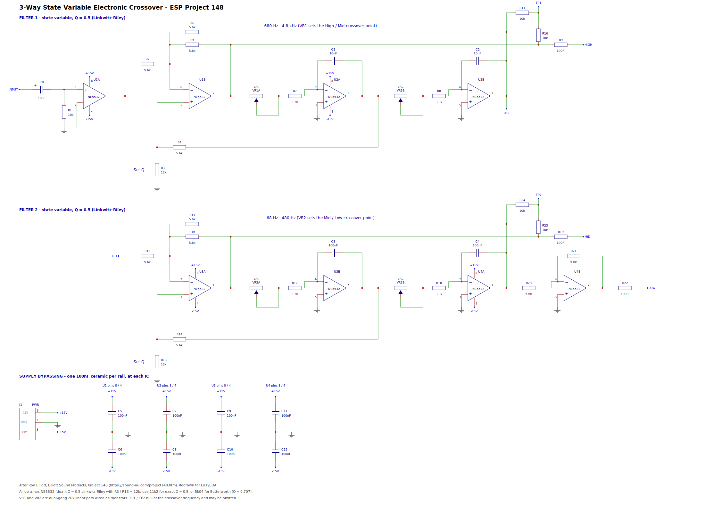

# Variable Crossover — ESP Project 148

An EasyEDA-importable schematic for the **3-way state variable electronic
crossover** from Elliott Sound Products Project 148
(<https://sound-au.com/project148.htm>), redrawn from Figure 2.

Two cascaded 2nd-order state variable filters, 12 dB/octave, with continuously
variable crossover frequencies (680 Hz – 4.8 kHz and 68 Hz – 480 Hz) and
adjustable Q. One channel — build two for stereo.



## Importing into EasyEDA

EasyEDA Std (<https://easyeda.com/editor>):

1. **File → Open → EasyEDA…**, or **File → Import → EasyEDA**.
2. Choose `schematic/esp-p148-3way-state-variable-crossover.json`.

If that file is rejected by your editor version, try
`esp-p148-3way-state-variable-crossover.legacy.json` — identical drawing, but
with the older string-form document header that some builds prefer.

For EasyEDA Pro: **File → Import → EasyEDA Std**, then pick the same `.json`.

Footprints are named generically (`R_AXIAL-0.4`, `DIP-8`, …) so they will need
assigning from the EasyEDA/LCSC libraries before PCB layout. See "Known
limitations" below.

## Repository layout

```
schematic/   EasyEDA schematic (.json), plus preview.svg / preview.png
docs/        circuit-notes.md — how the circuit works, design equations
             netlist.txt      — netlist extracted back out of the drawing
bom/         bom.csv
tools/       gen_schematic.py — generates everything above
```

## Regenerating

The schematic is generated, not hand-edited, so that the drawing and the netlist
can't drift apart:

```sh
python3 tools/gen_schematic.py     # optional: pip install cairosvg for the PNG
```

The script places every component and wire on a 10 px grid, derives junction
dots from wire degree, then **re-extracts the netlist from the finished
geometry** and prints it. That extracted netlist is what's in `docs/netlist.txt`
— it is a check on the drawing, not a restatement of intent.

## Circuit summary

| | Filter 1 | Filter 2 |
|---|---|---|
| Summing amp (high-pass out) | U1B → **HIGH** | U3A → **MID** |
| Integrator 1 (bandpass, feedback only) | U2A | U3B |
| Integrator 2 (low-pass out) | U2B → filter 2 | U4A → U4B → **LOW** |
| Frequency pot | VR1 (dual 20k) | VR2 (dual 20k) |
| Integrator caps | C1, C2 = 10 nF | C3, C4 = 100 nF |
| Range | 680 Hz – 4.8 kHz | 68 Hz – 480 Hz |
| Q resistor | R3 = 12k | R13 = 12k |

Q = (5.6k + Rq) / (3 × Rq): 11k2 gives exactly 0.5 (Linkwitz-Riley), 12k as
drawn gives 0.489 (< 0.2 dB ripple), 5k04 gives Butterworth (Q = 0.707, 3 dB
peak in the summed response).

The inverter U4B sits on the **bass** output rather than the midrange because
U3A, the input amplifier of the second filter, is already inverting.

TP1 and TP2 sum each filter's high-pass and low-pass outputs through 10 k
resistors; the signal nulls at the crossover frequency, so you can measure it
exactly with an oscillator. They're optional — the ESP PCB omits them.

Full explanation, design equations and frequency tables: [`docs/circuit-notes.md`](docs/circuit-notes.md).

## Additions to the original drawing

The ESP figures deliberately leave out supply wiring. This schematic adds it so
the netlist is complete:

* **J1** — ±15 V and ground input.
* **C5–C12** — 100 nF ceramic from each op-amp's pin 8 and pin 4 to ground, as
  the article's text requires. Mount them right at the ICs.
* **R10/R11** and **R23/R24** — the unlabelled 10 k test-point resistors in
  Figure 2, given designators.

## Known limitations

* **Op-amps are drawn as separate sections** (U1A/U1B, U2A/U2B, …) rather than
  as multi-part components, so the BOM lists eight NE5532s where you only need
  four dual packages. Before PCB layout, merge each pair onto one DIP-8/SOIC-8
  part in EasyEDA. Supply pins 8 and 4 appear on the A section of each package
  only, which is the usual convention.
* **VR1 and VR2 are two dual-gang 20 k pots**, drawn as four gangs (VR1A, VR1B,
  VR2A, VR2B). Both gangs of a pot must track reasonably well.
* **Footprints are placeholders.** Assign real ones from the EasyEDA/LCSC
  library for your parts (axial vs. 0805, pot body, etc.).
* One deliberate wire crossing per filter, where the low-pass feedback rail
  crosses the high-pass rail. Crossings without a junction dot do not connect.

## Building notes

* NE5532 is what the article specifies, for noise. Any decent audio dual op-amp
  will work.
* The 5.6 k resistors were 10 k in earlier versions of the article; 5.6 k was
  chosen to reduce thermal noise. Anything up to 10 k is fine, above that isn't
  recommended.
* To move a frequency range, change the integrator capacitors — smaller caps
  give a higher range. 4.7 nF in filter 1 gives roughly 1.45 kHz – 10 kHz.
  Watch that a test tweeter isn't driven below its rated minimum frequency.

## Credit and licence

Circuit design © Rod Elliott, Elliott Sound Products, Project 148 (2014).
The ESP article grants personal use and one printed copy for reference while
building; commercial use needs Rod Elliott's written permission. This repository
holds a re-drawn schematic for personal construction — please read the article
itself, and buy the ESP PCB if you want one.
