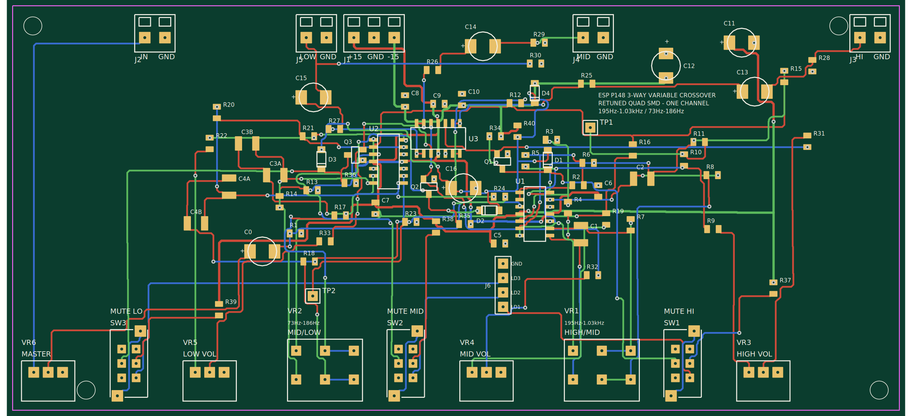

# SMD board — retuned-quad-smd, for JLCPCB fab + assembly

`pcb/esp-p148-3way-crossover-retuned-quad-smd-pcb.json`, generated by
`tools/gen_pcb_smd.py`. **156.2 × 71.4 mm**, four layers, fully routed,
with nine front-panel controls on the board - a frequency pot and a volume
trim for each of the three bands, a master volume, and a mute button per
band - trace width matched to purpose (12 mil signal, 16 mil +15V/-15V/GND), and
45° chamfered corners throughout.

Beyond the filter it carries buffered outputs with build-out resistors, DC
blocking and bleeders, bulk and per-IC supply decoupling, and per-output
muting with power-up soft start. Which parts do which job is listed block
by block in
[`circuit-notes.md`](circuit-notes.md#function-blocks-on-the-smd-board).



One channel. Build two for stereo.


## What is verified

The generator routes the board and then checks it with geometry that does not
reuse the router's own bookkeeping. On the current output:

```
board 156.2 x 71.4 mm | 86 footprints | 242 pads | 217 tracks | 148 vias
verified: all nets connected, all clearances >= 8 mil, no unrouted nets,
          pads match the schematic exactly
```

**The pinned rows cost height, but far less than the first board that
had them suggested.** The board before the rows existed was 141.7 × 70.4 mm
and verified clean, but it did that partly by putting parts in the strip in
front of the pot row - where the front panel goes - and behind the connector
row. The first clean board with the rows in paid 14 mm for forbidding that
(70.4 → 84.8); the current one pays 2 mm less than the free-terminal board
ever did, at 68.1 mm. The cost was mostly the seed, not the constraint -
which is worth knowing before treating a single search result as the price
of a requirement.

## Ground is fanned out, not repaired

Every SMD ground pad gets **its own via to the plane before a single signal
net is routed**. A through-hole pad needs none of this - it is already on
every layer, plane included.

This is standard practice, and on this board it is also the difference
between a clean verify and a permanent defect. Ground used to be repaired
AFTERWARDS, by looking for somewhere to put a via once the traces were
down, and by then the answer at the worst pads was "nowhere":

```
plane via Q1.2:   no site in 33 candidates (clearance x32, drill keepout x1)
plane via U2D.12: no site in 33 candidates (clearance x27, drill keepout x6)
```

Those refusals are exact geometry, not the router's bookkeeping: signal
traces had been routed hard against those pads and no 0.71 mm via pad plus
0.2 mm of clearance fits near them any more. Nothing threads to a pad that
is boxed in - something else has to move, and the cheapest something else
is a trace that has not been routed yet. Placing the via first turns it
inside out: the via becomes copper the signal nets route AROUND.

Measured on this placement, sweeping twelve route orders each way:

| | best result | pour failures |
|---|---|---|
| repair afterwards | 1 stranded ground pad | **12 of 12** route orders |
| fan out first | 1 unrouted net | **0 of 12** |
| fan out first, production rip-up | **0** | 0 |

It is a real trade and it was not obviously going to pay: 24 through-hole
vias each block 4.4 units on all four layers, so ground buys its
connection with routing room the signal nets were using. What makes it
worth taking is not the raw count but the KIND of failure left over. A
pour pocket is made by the placement and no route order touches it; an
unrouted net is what route order fixes, repeatedly and by a lot.

**And the via has to be judged by real geometry.** `via_ok()` reads the
ROUTER's occupancy grid, which carries dilated keepout rings sized so a
TRACE has room for its own half-width, plus `contested` wherever two nets'
rings merely overlap. Between two SOIC pads nearly every cell is
contested, so it refuses a via that has 2.9x the clearance it needs:

```
via centred on a SOIC ground pad
  neighbour pad edge  3.75 units from the pad centre
  via pad edge        1.40
  real gap            2.35 units (0.597 mm) vs CLEAR 0.80 - LEGAL
```

`pad_plane_via()` therefore checks the same exact geometry `verify()` uses
plus the real drill rules, and ignores `occ` entirely. That fix alone took
stranded pads from five to two before fanout existed. It is the same
lesson as "do not model the pour from `occ`", one level up: `occ` is the
router's own conservative bookkeeping and it is not a clearance rule.


The checks are:

* **Clearance** — every pair of copper features (pad, track segment, via) that
  shares a layer and belongs to different nets, by exact geometric distance,
  using each net's *actual* trace width (12 mil signal, 16 mil power/ground -
  see "Trace widths" below). Must be ≥ 8 mil. JLCPCB's limit is 5 mil, so
  there is margin.
* **Connectivity** — union-find over touching same-net features, vias linking
  layers. Every pad of a net must end up in one piece.
* **Schematic agreement** — the pad set must equal the schematic pin set, both
  directions.
* **Mounting holes** — nothing may sit within 8 mil of an M3 hole.
* **Board edge** — every pad inside the outline, and no copper within 0.5 mm
  of it.
* **Wasted area** — the board is gridded and the largest all-empty rectangle
  found, arithmetically. Utilisation is reported every run, and a single void
  over 10 % of the board is an error. This is the "why is there a big empty
  patch" question answered by measurement instead of by squinting at a preview.
* **Silkscreen** — no silk over an exposed pad (the fab clips it), none over a
  top-layer trace or via, none running off the board edge.
* **Footprint courtyards** — every pair of placed components' bounding boxes
  (pads *and* silkscreen label, not just pads) must not overlap. Copper
  clearance alone only catches an overlap if two parts' pads happen to collide
  too; this catches two component *bodies* sitting on top of each other even
  when their copper never touches.

These caught real defects during development that would have reached the fab
otherwise: vias placed too close to foreign copper (a via is wider than the
track that leads to it, so a cell that is safe for a track is not automatically
safe for a via); an occupancy grid that recorded only the first net to claim a
cell, letting a second net route into the same keep-out; two test-point pads
sitting on top of mounting holes; the parallel tuning caps carrying an 0805
footprint when they are 1210 parts; tracks routed straight through the pot
locating holes; when the pots were added, eight nets left unrouted and three
left in disconnected pieces; when trace widths were first split by purpose,
pad keepouts that had been sized from the *pad's own* net rather than
from the widest trace that might pass nearby - backwards, and the cause of
every clearance violation that turned up while that version was in place; and,
once the footprint-courtyard check existed at all, two adjacent 1210 tuning
caps that had been overlapping by 0.6 units even before this round of changes
started - the 1210 footprint (18.6 units with clearance) is wider than the
18-unit placement-grid pitch, and nothing before this check compared two
components' *bodies* against each other, only their copper. Fixed by making
placement itself collision-aware (checking real per-part boxes as it assigns
slots) instead of just widening the grid pitch for every part, which would
have wasted area on every 0805 that didn't need it.
Not one of those was visible in the preview image.

## The stackup

Four layers, JLCPCB's standard 1.6 mm 4-layer build:

| | | |
|---|---|---|
| **L1** | TopLayer | signal, every SMD pad, GND pour |
| **L2** | Inner1 | **solid GND plane** - nothing is ever routed here |
| **L3** | Inner2 | signal |
| **L4** | BottomLayer | signal, GND pour |

Three signal layers and one uninterrupted ground: the standard analogue
4-layer arrangement.

**Why it is four and not two.** Two layers ran out. Once the three panel
mute buttons went into the front row, ~115 placement seeds and
route-order sweeps could not produce a board that verified - eight nets
left in pieces, both supply rails among them - on a board only 54%
utilised. Running out of copper at 54% is the signature of running out of
CHANNELS rather than of area, and the lever for that is layers. Finer
design rules were measured first and were worse (`CLEAR=0.6` scored 106
DRC problems against 54), because `CLEAR` feeds the placer's own cost
model as well as the router's rule: turn it down and the placer believes
escapes are cheaper than they are and packs tighter.

**What the plane buys, beyond capacity.** GND stops depending on a pour
threading its way between pads on a signal layer. Every ground pad now
reaches the plane straight down through a via, and a via ties all four
layers because JLCPCB's standard process has no blind or buried ones.
"The ground pour does not reach N pad(s)" - the single most common reason
a board in this project failed to verify - largely stops being a category
of failure.

**Vias.** All through-hole, 0.6 mm drill / 0.71 mm pad as before. Each one
punches an antipad in the plane, which the pour cuts automatically at
`POUR_CLEAR`; the router does not model the plane at all, which is
deliberate - see `PLANE_L` in `tools/gen_pcb_smd.py`.

**Building the two-layer version.** `LAYERS=2 python3 tools/gen_pcb_smd.py`
still works and is what every measurement in this file dated before the
stackup change was taken on. It will not route this board clean.

**Cost.** A 4-layer order is dearer than 2-layer at the same size - that
is the trade, and it is the only thing 4 layers costs here. Every
geometric limit `validate_fab.py` checks is the same or looser on the
4-layer process.

## Trace widths

Every trace used to be the same 8 mil regardless of what it carried. Widths are
now matched to purpose:

| | Width | Carries |
|---|---|---|
| Signal | 12 mil | A few mA at most - the crossover's actual audio signal |
| +15V, -15V, GND | 16 mil | The combined supply current of both quad op-amps, and (GND) the audio return path |

**Current capacity was never the constraint at any width considered**, and
that's worth being explicit about rather than implying otherwise. By
IPC-2221's external-layer formula for 1 oz copper,
`I = 0.048 · ΔT^0.44 · (w[mil] · 1.378)^0.725` at a conservative 10°C rise:

| Width | Capacity | vs. ~58 mA worst case (both op-amps, loaded) |
|---|---|---|
| 8 mil (the original, one-size-fits-all trace) | ~750 mA | ~13× |
| 12 mil (current signal) | ~1.0 A | ~17× |
| 16 mil (current power/ground) | ~1.25 A | ~21× |

So why not stay at 8 mil and save the board area? Because a trace
noticeably thinner than its pad reads as a mistake, not a design choice, on
a board this densely packed with fat hand-solder-friendly pads. 12/16 mil
puts signal traces at roughly 1:3.3 and power traces at roughly 1:2.5 against
an 0805 pad's 40 mil short dimension - inside the range of thumb that PCB
layout guides commonly cite for a trace that looks intentional rather than
broken (e.g. the general routing-technique discussions at
[aivon.com](https://www.aivon.com/blog/pcb-design/pcb-routing-techniques-a-comprehensive-guide-to-efficient-trace-layout/)
and [allpcb.com](https://www.allpcb.com/allelectrohub/pcb-layout-considerations-and-best-practices)
— unaudited sources, cross-checked here only against the IPC-2221 numbers
above, which is the part that actually matters). The wider traces cost some
board area, but the courtyard fix and the rotation-aware placement search
below (which shrank the board on their own) more than paid for it - the
final board is *smaller* than the 76.2 × 50.8 mm version that used thinner
traces, not larger.

Getting this correct (not just wider) took two real fixes, both caught by the
clearance check rather than assumed:

* **Pad keepouts had to stop depending on the pad's own net.** A pad's
  clearance requirement is about what might route *past* it, which has nothing
  to do with what net the pad itself is on - the first version reserved room
  based on the pad's own net, which under-reserved every signal pad by exactly
  the signal/power width difference. IC pads were then kept as a deliberate
  exception - own-net-based and skipping the grid margin - on the reasoning
  that a 16 mil trace could not fit between two SOIC pins anyway. That
  exception has since been removed, because both halves of it were wrong:
  the inter-pin channel needs 2.8 units and has 2.5, so nothing legal ever
  fit there, and the exception applied to the pad's *whole perimeter*, not
  just the gap between pins, leaving a trace running past an IC pin sitting
  exactly on the clearance limit with nothing spare for 45° chamfering to
  eat. Every layout the placement search produced tripped it at 7.4-7.8 mil
  against an 8 mil rule; the hand-placed board escaped only because no trace
  happened to take that route.
* **A wide net can't trust a tight keepout it didn't create.** Pathfinding for
  +15V/-15V/GND checks a widened neighbourhood, not just the literal cell, so
  it can't hug a pad reservation that was sized for a thinner trace. That
  neighbourhood is precomputed once per net (a single vectorised dilation) and
  reused for every cell A* visits, rather than recomputed per cell - the first
  version did the recompute-per-cell version, which was correct but took
  several minutes instead of the ~30 seconds a run takes now.

## Corner routing

The router is a strict 4-directional grid A* (see `astar()`/`emit_path()` in
`tools/gen_pcb_smd.py`) - every trace it produces is pure right-angle
Manhattan routing. 90° corners are legal and JLCPCB will happily fab them,
but sharp right-angle traces are widely flagged in PCB layout guides as
worth avoiding where free: historically an acid-trap risk during etch, and
even where that no longer applies (as here) a 90° corner still reads as
unfinished/auto-routed rather than hand-checked (see the general layout
discussions cited above, and e.g.
[tinycomputers.io](https://tinycomputers.io/posts/the-mathematics-of-pcb-trace-routing.html)
on routing geometry - again, unaudited, used only for the general practice,
not for any specific numeric claim).

Rather than rewrite the router itself to search in 8 directions (a much
larger change, with its own diagonal-clearance and diagonal-via rules to get
right), every routed polyline gets a post-process **chamfer**: each interior
90° corner is cut back by 15 mil along both legs and replaced with a short
45° diagonal. Endpoints - which land exactly on a pad or via - are never
touched.

This is safe by construction, not just by inspection: every point stamped
while routing already carries `CLEAR + MAX_W/2 + GRID` = 1.85 units of margin
beyond its own half-width, reserved so that *later* nets treat it as
occupied. A 15 mil chamfer deviates from the original corner by at most
`15 mil / √2 ≈ 10.6 mil`, comfortably inside that reserved margin - so the
cut can never intrude on a net that routed afterward and stayed clear of the
original right-angle corner. The independent geometric verifier checks the
*actual* chamfered geometry (not the router's pre-chamfer path), and the
board still comes back with zero clearance or connectivity problems after
chamfering every corner.

## Vias

0.20 mm annular ring (2.8 mm pad, 1.2 mm drill) - bumped up from an earlier
0.15 mm, which an independent DFM review flagged as leaving essentially no
margin against ordinary drill-to-pad registration tolerance at a
fabricator. 0.20 mm is comfortably inside JLCPCB's process capability.

### Ground stitching

Ground is poured on all four layers - solid on Inner1 - and every
through-hole part - the five
pots and all five terminal blocks - ties those two pours together for free
simply by being a plated hole. The SMD-only ground connections don't get
that: `R1`, `R3` and `R13` (the input bias return and the two Q-setting
resistors) would otherwise reach the opposite pour only through whatever
via a stub happened to need.

Each of those now gets a **deliberate second via placed right beside it**,
after all routing (including retries) is finished. It matters most at
`R1`, the input stage's ground reference, where the signal is at its
smallest and has no gain ahead of it to swamp any hum picked up across a
higher-impedance ground path.

Each candidate position is checked with the same strict `via_ok()` the
router itself uses, and the first of four offsets that passes is taken, so
a spot that would actually crowd existing copper is skipped rather than
forced. Cheap insurance: 5 GND vias on the current board, no measurable
cost in area or routing.

## Silkscreen over copper

No label may sit over a top-layer trace or via, enforced by construction: every
top-silk label's bounding box is stamped as a routing keepout *before* routing
starts, on the top copper layer only (bottom copper is the other side of the
board, so it can't visually clash with top silk). One deliberate exception -
a designator sitting right beside its own part's pads is allowed to displace
that part's own keepout *ring* (never the pad's literal footprint), since
nothing has been routed yet at that point and forcing the trace out just makes
it leave the pad in a slightly different direction.

## Parts

Every part was looked up live against the JLCPCB parts API. Stock figures are
from that lookup and will drift — **re-check before ordering**.

| Value | Designators | Package | LCSC | Library | Stock at lookup |
|---|---|---|---|---|---|
| MC33079 | U1, U2 | SOIC-14 | C9376 | extended | 25 307 |
| 33nF PPS ±2% 50V | C1, C2, C3A, C3B, C4A, C4B | 1210 | C569866 | extended | 2 001 |
| 100nF X7R 50V | C5–C8 | 0805 | C49678 | **basic** | 14 609 213 |
| 10µF 50V | C0 | SMD D5×L5.4 | C46550416 | extended | 288 863 |
| 100R 1% | R9, R19, R22 | 0805 | C17408 | **basic** | 7 430 702 |
| 4.7k 1% | R7, R8 | 0805 | C17673 | **basic** | 6 989 256 |
| 5.6k 1% | R2, R4, R5, R6, R12, R14, R15, R16, R20, R21 | 0805 | C4382 | **basic** | 787 448 |
| 10k 1% | R1, R10, R11, R23, R24 | 0805 | C17414 | **basic** | 34 645 450 |
| 11k 1% | R3, R13 | 0805 | C17429 | extended | 78 383 |
| 13k 1% | R17, R18 | 0805 | C2933304 | extended | 213 066 |

Five extended part types (JLCPCB charges a one-off fee per extended type).
Two are avoidable if you care: **R3/R13 could be 12k** (basic, C17444) at a cost
of 0.14 dB in the summed response. **R17/R18 cannot** — 12k would push filter 2's
top end to 201 Hz, above filter 1's 195 Hz minimum, which re-creates the range
overlap the retune existed to remove.

### Why the tuning caps are two 33nF in parallel

C3 and C4 want 68nF. At 50 V, in a film or C0G dielectric, 68nF is not stocked:
the PPS part exists only at 16 V (too close to the ±15 V rails) and C0G at that
value is scarce, expensive and ±10%. Two 33nF ±2% PPS in parallel give 66nF —
which with R17/R18 = 13k puts filter 2 at **73–186 Hz**, against the 71–180 Hz
of the through-hole build.

This is better than the alternative rather than a compromise. Every tuning
capacitor on the board is now the same part from the same reel, and **matching
between C1/C2 and between C3/C4 is the tightest tolerance that matters in this
circuit** — a 10% mismatch costs 0.41 dB. Ordinary X7R would have been cheap and
available, and wrong: its voltage coefficient puts distortion in the signal
path, which is exactly what this design is otherwise careful to avoid.

## Ordering

1. Import the PCB into EasyEDA Std: **File → Open → EasyEDA…**
2. **Look at it.** Run **Design → Design Rule Check** with JLCPCB's rules.
3. **Export the Gerbers from EasyEDA**, and **export the BOM and CPL from
   EasyEDA too** — not the CSVs in this repo.

   `bom/jlcpcb-bom-retuned-quad-smd.csv` is reliable (it is just value,
   designator, footprint, part number). `bom/jlcpcb-cpl-retuned-quad-smd.csv`
   is **reference only**: a CPL's coordinates are relative to whatever origin
   the Gerbers were generated with, and only EasyEDA knows that at export time.
   Using the wrong origin puts every part in the wrong place.
4. Upload to JLCPCB, choose assembly, and check the rendered preview before
   paying — the preview shows part orientation, which is the usual failure mode.

## The potentiometers

**VR1 and VR2 sit on the board**, on the front edge, on the same 80-unit
knob pitch that spaces every KNOB on the board, VR1/VR2 included (see
"Output volume control" below); it grew from an earlier, VR1/VR2-only
spacing of 110 units when the volume trims needed real pitch of their own,
and the row is no longer uniform now that the mute buttons are in it (see
"The mute buttons"). The board
lies flat in the enclosure, **perpendicular to the front panel**, with
right-angle pots on the front edge and their shafts through the panel -
the arrangement a small amplifier or preamp board normally uses. Every
control in the row is an edge-mount part for that reason, the mute buttons
included.

The footprint is the near-universal **9 mm dual-gang pattern**: six terminals in
two rows of three. Real parts
are on 5.00 mm centres and this footprint is on 5.08 mm (0.2 in), because pad
centres must land on the routing grid; the 0.08 mm per pitch is absorbed by the
1.2 mm holes.

**There are no locating-boss holes.** There used to be two, at a position
that was openly a guess: no verified dual-gang mechanical drawing was ever
found for this part, and LCSC's footprint API - the one this file
documents using - now answers `403` from CloudFront, so there is no longer
a way from here to turn the guess into a measurement. Between shipping an
unverified hole and shipping none, none is strictly the safer default: a
missing hole is two minutes with a hand drill against your own part's
datasheet, and a hole in the wrong place is a re-order. The pots solder in
through six pins and sit against the panel; the bosses locate, they do not
carry load.

> **Verify this against your pot's datasheet before ordering.** LCSC stocks
> RK09-family 20 k parts (e.g. C470290, ~1200 in stock) but the API does not
> expose gang count or mechanical dimensions, so this footprint is drawn from the
> standard pattern rather than from a specific verified part. It is a
> parametrised function in `tools/gen_pcb_smd.py` — easy to correct.

JLCPCB will not assemble the pots; solder them yourself, along with the
connectors and test points.

## Output volume control

**Each output (VR3 HIGH, VR4 MID, VR5 LOW) gets its own single-gang 10 kΩ
audio-taper pot**, wired as an attenuator between that band's filter output
and its terminal block - not part of the filter, and not touching the
filter's own gain-setting resistors. Electrically this is a plain voltage
divider: the filter's op-amp output already drives a low impedance, so it
can source a 10 kΩ pot with no measurable effect on the filter response,
and since a divider only ever attenuates, it introduces no new clipping
risk.

Audio taper (log), not linear, because this panel is meant to work as the
system's actual volume control per band, adjusted by ear - a linear pot
feels bunched up, with most of the audible change crammed into the last
10-20° of rotation.

Part: **Alps Alpine RK097111080R, LCSC C470577** - 10 kΩ, taper code `15A`
(audio/log per Alps' own product page), single-turn, 3-terminal through
hole, 826 in stock at lookup. The AliExpress "RK097N" listing this was
sourced from is a rebrand of the same genuine Alps series (same model
family, same spec sheet), which is why it was worth chasing down a real
LCSC part rather than parametrising a guess: unlike VR1/VR2's dual-gang
footprint, this one has a verified EasyEDA pinout+footprint behind it.
**Still worth a stock/spec re-check before ordering** - taper especially,
since neither the LCSC nor the JLCPCB parts API exposes it directly; it
came from Alps' own product page for this exact part number.

**Pad geometry is pulled from that real footprint, not guessed**: 2.5 mm
pin pitch (drawn on 2.54 mm, the nearest 0.5-unit grid point - absorbing
the same kind of sub-0.1 mm slop the dual-gang footprint already does
between its 5.00 mm real pitch and its 5.08 mm drawn one), ~1.9 mm pads,
~1.2 mm holes, all read directly from LCSC/EasyEDA's own PCB-layer SVG for
C470577 (`/api/products/C470577/svgs`). The first version of this
footprint just reused the dual-gang pattern's 5.08 mm pitch without
checking it against this specific part - about 2x too wide, and the reason
a rendered preview of it looked barely different from VR1/VR2. The ~9 mm
body/knob-collar circle is still a sketch from the AliExpress listing's
stated dimensions, not the same verified source - reasonable for a
courtyard, not a certified mechanical drawing.

Panel layout, left to right:

**MASTER (VR6) - [MUTE LO (SW3)] LOW VOL (VR5) - MID/LOW (VR2) -
[MUTE MID (SW2)] MID VOL (VR4) - HIGH/MID (VR1) - [MUTE HI (SW1)]
HIGH VOL (VR3)**

Nine controls: each volume trim flanks the frequency pot for the band it's
nearest, and each mute button sits immediately left of the volume trim it
mutes, so the two controls for a band read as a pair.

Two pitches, because two different things set them. Knob to knob is
`PANEL_PITCH`, 80 units (20.3 mm) - a knob for a 6 mm shaft is 15-20 mm
across, so much less has adjacent knobs touching. Knob to button is
`SWITCH_PITCH`, 56 units (14.2 mm), which leaves `2 x 14.2 - 18 = 10.4 mm`
of finger room between the two knobs a button sits between. Neither number
can be left to the optimiser: the courtyards would allow 58 and 34 units
respectively, and the optimiser has no model of a fingertip.

Every pot footprint, single- or dual-gang, has the same 26-unit body
half-width, so the shared knob pitch is what actually determines spacing -
see "Routing more controls" below for what happened when the first attempt
reused VR1/VR2's old, tighter spacing instead.

The row is also lined up on its **courtyard fronts**, not its pad rows: the
switch's mounting-lug pads reach ~0.8 mm further forward than a pot's body
does, and it is the board edge, not the pad row, that has to be one
straight line for the panel to sit flat against every control at once.
`PANEL_Y` computes the offsets from the probed geometry, so a footprint
change carries through instead of quietly leaving one control short.

## Two pinned edge rows

Everything that has to reach an edge is pinned into one of **two rigid
rows**, and they go down before anything else is placed:

* the **panel row** on the front edge - nine controls, `PANEL_X`/`PANEL_Y`
* the **rear row** on the opposite edge - `J2` (IN), `J5` (LOW), `J1`
  (power), `J4` (MID), `J3` (HIGH), on `REAR_X`/`REAR_Y`

The x of each rear part is borrowed from the panel row, so the two line
up: `J2` above MASTER (the input feeds the master volume, so that is the
short net), each output above the volume pot that feeds it, and `J1` in
the largest gap left - mid-board, the shortest average distance from the
power terminal to the three ICs and a long way from the input. Each row is
aligned on the parts' outer FACES, not their pad rows, so the row presents
one flat plane to its edge.

**Why pin them at all.** Their positions were never really a search
problem - a pot has to be at the panel and a screw terminal has to be at an
edge - and leaving them free produced exactly what you would expect: `J2`,
the input, ended up in the bottom-left corner facing across the board, on
the same edge as the panel. `place.seed()` skips grouped parts, so pinning
a row also means everything else gets seeded *around* it rather than the
row having to fight into a board that is already full.

**And a row defines a plane.** `edge_violation()` checks a rigid row as
one wide part against its own outer face, with no column test; a lone
edge-facing part is still checked per column (see the docstring for why
the two cases differ). Per-column alone was not enough and the board showed
how: `PANEL_PITCH` leaves 41 units of clear gap between one knob and the
next, part of no column, and the anneal happily parked C5/C6/R2/R4 in
*front* of the pot row - where the front panel has to go.

The weight is `W_EDGE`, and unlike the other placement weights it is priced
to be **unpayable rather than traded**: it expresses a mechanical fact, not
a routability guess. At the old 40 the anneal parked `J6` 5.7 mm in front
of the panel row and paid 20k out of a 142k total to keep it near its
switch. At 400 the term reads zero.

Board size is still an OUTPUT. The rows are pinned in x and in their
row-relative y, but each row's absolute depth is free - it is a rigid
group, and the anneal slides the rear row in until the parts between the
two rows stop it. What is fixed is only that nothing may be outside either
row, so the board edges land `EDGE` (1.27 mm) behind each one.

`WIDTH_LOG=1` prints a `rows:` line naming anything that got outside a row
and by how much, because the board line only reports the total and a part
sticking out is invisible in it.

## The mute buttons

**SW1, SW2 and SW3 are on the board**, in the front-panel row, one beside
each band's volume trim. They are **G-Switch PS-22E05** (LCSC `C2848949`,
~£0.16, 925 in stock at the time of writing): a **right-angle push-lock
DPDT**, so the plunger comes out of the board edge in the same direction as
the pot shafts and goes through the same panel. That is the whole reason
for this part: the board sits flat in the enclosure, perpendicular to the
front panel, so every control has to be an edge-mount one.

The footprint is drawn from G-Switch's own outline drawing (PS-22E05
rev X1, 2016-05-29), P.C.B LAYOUT / BOTTOM VIEW panel - not from another
footprint, and not from a listing's stated dimensions:

| | |
|---|---|
| signal pins | 6, 0.8 mm holes, 2 x 3 on a 2.5 mm grid |
| mounting lugs | 2, 1.3 mm holes, 4.0 mm across x 11.4 mm along, diagonally opposite |
| body | 12.0 x 6.6 mm, 11.9 mm tall |
| plunger | 10.3 mm proud of the body at rest, 3.5 mm travel, 2.2 mm to latch |
| rating | 0.5 A 30 VDC, contact resistance <= 100 mOhm, 10,000 cycles |

Drawn on 2.54 mm rather than the datasheet's 2.5, the same sub-0.1 mm slop
`fp_pot_single` already absorbs: 0.08 mm accumulated across the pin field
against a 0.86 mm hole on a 0.5 x 0.6 mm pin.

**Three things about this part are taken on trust and should be checked
with a meter on one switch before ordering.**

1. **Which throw closes when it latches.** The drawing shows the two poles
   and the non-shorting changeover but never says which end the common
   latches onto, and no distributor page does either. The generator
   assumes the end away from the plunger. `MUTE_SW_SENSE=beta` swaps it -
   both spare throws are drilled and plated either way, so being wrong is
   a regenerate rather than a rework.
2. **Whether the frame lugs are isolated from the contacts.** The board
   solders them to GND, because they take the push force and a dry lug on
   a switch you press is a joint that eventually cracks. Every switch of
   this construction has an isolated frame; the drawing does not say so.
3. **That it is the LOCK variant.** The family part number is PS-22E05XX
   where the suffix carries N = no lock, L = lock (and a cap colour). LCSC
   lists `C2848949` as plain "PS-22E05" under its self-locking category,
   which is the reason for believing it latches.

The LED pole is wired so none of this matters to the indicators: it is
taken from the throw at the *opposite* end from the mute ground, so
whichever way the mechanism goes, the LED is lit exactly when its band is
not muted. See `docs/circuit-notes.md`.

**Pitch is set by fingers, not by copper.** The panel row now has two
pitches - `PANEL_PITCH` (80 units, 20.3 mm) between knobs and
`SWITCH_PITCH` (56 units, 14.2 mm) between a knob and the button beside
it. The button's courtyard would allow 34 units, but what actually sets
the number is that `2 x 14.2 - 18 = 10.4 mm` of gap has to be left between
the two knobs a button sits between, for a fingertip. Using the knob pitch
for the buttons would have cost 30 mm of board and bought nothing.

JLCPCB will not assemble these; solder them yourself with the pots and
connectors.

## Not assembled

* **VR1, VR2** — the frequency pots (above).
* **VR3, VR4, VR5** — the per-band volume trims (above).
* **VR6** — the master volume, ahead of the input buffer.
* **SW1, SW2, SW3** — the mute buttons, in the panel row between the volume
  pots (above). Right-angle push-lock DPDTs, so the plunger comes out of the
  board edge alongside the pot shafts.
* **J6** — a 4-pin header for the optional panel LEDs. DC only; no audio
  leaves the board on it, and the mute switches no longer go through it.
* **J1** ±15 V and ground, **J2** input, and **J3 / J4 / J5** — one 2-way
  screw terminal block per output, each carrying its own signal *and its own
  ground return*, because each one runs to a separate power amplifier. Sharing
  a single ground pin between three amplifier feeds invites hum loops. All on
  the rear edge, opposite the controls, so the box wires up sensibly.
  Blocks are 3.5 mm pitch (drawn on 3.556 mm, absorbed by the 1.1 mm holes).
* **TP1, TP2** — the null test points, rear edge.

## Layout

**Board size is derived from the placement, not chosen for it.**
`tools/place.py` arranges the parts on an unbounded canvas and
`gen_pcb_smd.py` draws the outline around the answer. There is no
`BOARD_W`/`BOARD_H` to set.

That is a reversal. For most of this board's history the flow was: pick a
size, fit the layout into it, and grow it when a net would not route. It
produced boards that verified, but it could never do better than that,
because *a board-size search cannot fix a layout problem — it can only find
a size large enough to hide one*. Every time it was reached for here, the
real cause turned out to be structural, and is documented under "Routing
five more controls" below: pot spacing, route order, a long-haul net, a
silkscreen label sitting in a pin-escape corridor. None of those were
area problems and none of them were fixed by area.

### What the search optimises

A simulated anneal over each part's **position and rotation**, costed on:

| term | what it prices |
|---|---|
| overlap | courtyards may not intersect — ramped hard, and asserted afterwards |
| **escape** | each side of a part needs clear depth in proportion to the pads breaking out through it |
| **plane escape** | a side carrying a pad on a POURED net needs room for a via |
| congestion | RUDY wire demand against the tracks that physically fit per cell |
| wirelength | half-perimeter per net |
| size | height, plus any width past the panel row's floor |

**The escape term is what makes rotation mean anything.** Turning a SOIC
barely changes its area and hardly changes its wirelength; what it changes
is which of its sides has seven pins queuing to get out. That is the thing
that actually decided whether this board routed, every time — so it is
priced directly rather than hoped for as a side effect of shorter wires.
Its calibration was measured, not reasoned: pad count alone gives a one-pad
test point almost no claim on space, and TP1/TP2 duly came back unreachable
on a board where every IC pin routed, so every side carrying pads now has a
floor under what it can demand as well as a cap over it.

**The plane-escape term is the one that changed the hit rate.** Every board
this project ever rejected failed the same single way: `the ground pour
does not reach N pad(s)`, always at an op-amp ground pin or a bypass cap's,
and always in a pocket that had formed before a single signal net was
routed. The escape term above cannot see it. It is capped on pad count, so
a SOIC face asks for four track pitches and scores identically whether the
gap in front of it is three units or nine — and three units fits no via at
all, while the channel between two of the SOIC's own pads is 2.5 units,
narrower than a track plus its clearances. A ground pin in that position
has no way out and the cost function was blind to it.

So `PLANE_GAP` is not a tuned number, it is what a via physically costs:
`VIA_PAD + 2 × CLEAR` = 4.4 units of empty board. Any side carrying a
plane-net pad is charged the square of its shortfall against that, per pad,
at a weight above escape's — escape starvation makes a pin slow to route,
this makes it impossible. It shares `escape_of()`'s neighbour scan, so it
costs four extra multiplications rather than a second pass over every part.

**Measured, on routed boards.** Six seeds, same capped router, DRC
problems with the term against without:

| seed | 1 | 2 | 3 | 4 | 5 | 6 | total |
|---|---|---|---|---|---|---|---|
| `PLANE_GAP=4.4` | **2** | **11** | 13 | **3** | 15 | **16** | **60** |
| `PLANE_GAP=0` | 6 | 18 | **12** | 6 | **9** | 24 | 75 |

Four seeds better, two worse, 20% fewer problems overall. That is a real
effect and a noisy one - seed 5 is worse by six - so it is worth knowing
that this term buys a better *average* placement, not a guarantee about
any particular seed. Seed choice still has to be searched.

**What it is not, measured:** the term is *not* what makes the pre-routing
pour reach every pad. Screening 40 seeds with `PLANE_GAP=0` (the term
disabled) passes every one of them, exactly as screening with it on does.
The pre-routing pockets the repo's history describes were closed by
something else — running `plane_stubs()` before the signal nets, which
drops a via into the pocket while the channels are still free. So this
term's value is whatever room it leaves for the pour to *survive* the
signal routing, and that has not been isolated from seed-to-seed variation.
It is kept because the statement it prices is true and cheap to check, not
because a measurement was produced to defend it.

### The structural pre-filter

The same fact makes the search dramatically cheaper. A ground pad the plane
cannot reach *before* any signal net is routed can never be reached after
one — signal traces are foreign copper, they only ever take room away from
the pour, and the second stub pass runs on a board with strictly more of
them. So the verdict is final, and it costs one stub pass rather than seven
full routes.

`find_board.py` screens every seed that way first (about 1.5 s each,
against several minutes to route one) and routes only the survivors. A
doomed candidate would otherwise be paid for at full price: rip-up
dutifully re-routes the whole board six more times, learns a route order
for it, and arrives back at the same pocket — which the placer made and no
route order can open.

At the current part count it rejects nothing: 40 seeds out of 40 pour
clean before routing, so the remaining pour failures are ones the *signal*
traces create. The screen is kept anyway. It is exact, it costs a second,
and the failure it catches is the one that used to cost a search round —
a filter that is not binding today is not the same as a filter that is
wrong.

Placement takes seconds; routing takes minutes. That asymmetry is the whole
argument for doing it this way round - the search runs several restarts and
keeps the best, because it is far cheaper to search placement properly and
route once than to route a mediocre placement and go looking for a board
size that rescues it.

### What is pinned, and why

Three things are constraints rather than preferences, so the search is told
about them instead of being left to rediscover them:

* **The front-panel row** is a rigid group: nine controls, one line,
  LOW → HIGH left to right. Six of them are knobs on `PANEL_PITCH` and three
  are mute buttons on `SWITCH_PITCH`, each button immediately left of the
  volume pot it mutes. Two pitches rather than one because the constraint is
  the KNOB, not the control: pricing a 2.8 mm plunger at the knob pitch
  would have cost 30 mm of board for nothing. The knob pitch (80 units
  ≈ 20.3 mm) is
  a *human-factors* number — a knob for a 6 mm shaft is typically 15–20 mm
  across, so much tighter has adjacent knobs touching. The pot courtyards
  alone would permit ~58 units, which is exactly why it cannot be left to
  the optimiser: it has no model of fingers.
* **The three output terminals** are a second rigid row, in the same
  LOW → HIGH order, so each output block sits above the volume pot feeding
  it. Left free, they scattered to three different board edges — which costs
  nothing any of the cost terms can see, and is horrible to wire.
* **Screw terminals must reach a board edge**, since wire arrives from
  off-board. Expressed as "nothing may come between this part and the edge
  it faces, within its own column" — not "this part must be the outermost
  thing on the board", which sounds equivalent and is not: parts facing the
  same edge at different depths can never all be flush, so that version
  never reaches zero and the anneal stretches the board trying to pay it
  off.

### Rotation is searched for every part

Footprints are drawn once, in their own local frame, and a transform stack
turns them. Previously rotation was open-coded inside each footprint, which
meant only chips and SOICs could rotate at all — two thirds of the board was
un-turnable, and `fp_soic14` at 90° laid its pads from `x` rightward so the
package centre silently landed 15 units off.

The geometry the search reasons about is *probed*, never re-derived: each
footprint is drawn into a scratch buffer at each angle it is allowed to
take, and its courtyard and pad positions are read back off the shapes it
actually emitted. A separately maintained copy of those dimensions is
precisely how the dual-gang pot came to be drawn with its body hanging over
the board edge while every check thought it fit.

One consequence worth knowing about: silkscreen stays upright for
legibility, so rotating a part moves its label's anchor while the text still
runs left to right, which can fold a designator back across the part it
names. That is not cosmetic — silk reserves top copper, so a label lying on
a pin is a pin that cannot escape. `silk_ref_beside()` chooses the side in
the part's local frame and lays the text out in board space.

### The arrangement this produces

The two quads sit rotated so their pins escape into open space rather than
into the channel between them — the search finds this on its own now, but it
was worth 17 % of the board when it was first found by hand:

| Arrangement | Smallest that routes | Vias |
|---|---|---|
| Stacked, unrotated | 81.3 × 66.0 mm | 57 |
| Side by side, unrotated | 81.3 × 68.6 mm | 50 |
| Side by side, rotated | 76.2 × 61.0 mm | 43 |
| …plus the pot band used | 76.2 × 44.4 mm | 46 |
| …plus width matched to purpose (first pass, 10/16 mil) | 76.2 × 50.8 mm | 46 |
| …plus courtyard-aware placement, per-part rotation search, 12/16 mil, chamfered corners | 73.2 × 48.5 mm | 61 |
| …plus a volume trim on every output (five front-panel controls, not two) | 106.7 × 55.9 mm | 69 |

| **…placement searched, board size derived from it** | **97.0 × 64.8 mm** | **100** |

Every row above the last is a *hand-placed* board whose size was found by
search. The last is the current pipeline, and the honest comparison is that
it came out **slightly larger** — 6245 mm² against 5964 — differently
proportioned: 12.5 mm narrower, 10.4 mm taller, at 67 % utilisation. Part of
that is a deliberate trade: the silkscreen had to get thicker to be
printable (see below), which grew every courtyard. The
width is the part that is now principled rather than found: it falls out of
the panel row's own geometry instead of being a number that happened to
route.

What the change actually bought is method, not millimetres. Nothing has a
hand-tuned coordinate any more, rotation is searched for every part rather
than for two of them, and a candidate board can be routed and verified in
under a minute instead of ~25, which is what makes any of it checkable.

### Routing more controls

Going from 2 front-panel pots to 5, and later 6, was not just "make the
board wider." Four real problems turned up, in order, each caught by the
same independent verifier rather than assumed away:

1. **Spacing, not area.** The first attempt kept VR1/VR2's old 110-unit
   centre spacing (tuned for just the two of them) and tried to wedge VR4
   into the 56-unit gap between them - leaving about 1.4 units of clearance
   on each side. Not a courtyard violation, but tight enough to starve the
   neighbouring pins' escape routes: several boards 330-480 units wide came
   back with nets like `U1B.7`'s left unrouted or split, and growing the
   board further didn't fix it, because the board was already big enough -
   the *spacing between the new pots and the old ones* was the actual
   constraint. Fixed by giving every front-panel pot the same uniform
   80-unit pitch (`PANEL_PITCH` in `tools/gen_pcb_smd.py`), not by adding
   more area.
2. **A big net routed last.** Once spacing was fixed, `GND` (which touches
   over a dozen pads including several ICs' grounded reference pins) kept
   leaving exactly one of those reference pins - `U1D.12` or `U2D.12`,
   alternating between runs - unreachable. `route_order()` had it sorted to
   the *end* of the "touches an IC" priority tier, because it sorted that
   tier by ascending member count: smallest net first. A net that large
   needs first pick of its escape routes, not last, since it has the most
   pads to reach and the fewest alternatives once smaller nets have carved
   up the board around it. Fixed by giving GND/+15V/-15V an explicit first
   turn, ahead of even the IC-touching tier - reversing the order for
   *every* IC-touching net made things worse elsewhere (small point-to-point
   nets that used to route early precisely because they were small), so only
   the genuinely wide-reaching supply nets jump the queue.
3. **The router doesn't backtrack.** Even with both fixes, one or two small
   nets near the ICs would still come back split - a structural limit of a
   single-pass grid router with no rip-up-and-reroute: whichever net
   commits to a corridor first can trap whatever routes through the same
   area later, and that can't be fixed by more open board area elsewhere.
   Two additions instead: a **weighted A\*** heuristic (`1.02 ×` the
   Manhattan distance, in `astar()`) that also happened to fix a real
   performance problem - a plain Manhattan heuristic on a mostly-open grid
   produces huge flat frontiers of equal-cost nodes, so search time on a
   long, sparse route (exactly what the new pot nets needed) blew out from
   seconds to minutes; and a **second-pass retry** for anything the strict
   pass couldn't reach, using a relaxed passability check that ignores
   `CONTESTED` cells (cells flagged only because two nets' conservative
   dilated safety margins overlapped over still-*empty* space, not because
   real copper is there) and tries every other pad of the same net, not
   just the ones the first pass happened to reach. Retried over up to three
   rounds, since a pad that connects on round 1 grows the target for
   whatever's still isolated on round 2.

   The relaxed retry is not trusted on faith. It **did** once produce a real
   violation - a via at an actual -5 mil overlap, not a false-positive
   margin flag - which is exactly why `via_ok()` stayed strict even in
   relaxed mode (a via is wider than the track leading to it, and used by
   everything that routes near it afterward), and why every relaxed
   candidate now gets an exact-geometry clearance check, using the same
   distance math `verify()` uses below, against every existing pad, track
   and via of a different net *before* it's committed - not after. A
   candidate that fails is left for the next round rather than shipped.
   `path_geometry()` / `path_clearance_ok()` / `commit_path()` in
   `tools/gen_pcb_smd.py` are the split that makes this possible: compute
   the geometry, check it for real, only then stamp it and add it to the
   board.

4. **Member count isn't the same thing as distance.** Even after all of the
   above, `MID_PRE` (the wire from the MID filter's output to VR4's
   attenuator input) reproducibly came back split in two: `VR4.1` on one
   side, `R19.2` on the other, unchanged across several different board
   sizes and a deliberate attempt at moving VR4 off dead centre. `HIGH_PRE`
   /`MID_PRE`/`LOW_PRE` are 2-pad nets - the smallest, lowest-priority
   category under "smallest first" - but each one has to cross nearly the
   full width of the board, from the output stage to the front-panel pot
   row, the same problem GND had for the opposite reason (too many pads,
   not too much distance). Routed dead last by member count, a `*_PRE` net
   found every cell along that long corridor already claimed by nets that
   only ever needed to route locally. Fixed the same way GND was: an
   explicit early turn for anything ending in `_PRE`, ahead of the
   IC-touching tier. This is what actually cleared the board, not the
   board-size search or the off-centre nudge that preceded it - both are
   worth knowing didn't work, so a future round doesn't retry them first.

None of this changed what counts as a clean board - the same independent
verifier, checking the same exact geometry, is still the thing that decides
pass or fail. It only changed how hard the router tries, and how carefully
it checks its own optimism, before handing that verifier something to
check.

Silkscreen names every off-board connection: J1 pins are marked `+15V GND -15V`,
J2 `IN GND`, J3 `HIGH MID LOW GND`, and each pot carries the crossover it sets
(`HIGH/MID` on VR1, `MID/LOW` on VR2). Designator and label text is 1.0 mm
tall (was as small as 0.56 mm before an independent DFM review flagged it -
comfortably over JLCPCB's stated ~1.0 mm silkscreen legibility floor). You
should not need the schematic to wire it up.

Sockets along the rear edge, controls along the front, circuitry between.
Filter 1 upper, filter 2 lower, each quad amongst its own parts. Placement is
generated: parts are anchored at the centroid of the fixed pads they connect
to, assigned to the nearest free slot that neither the fixed layout nor an
already-placed part occupies, then improved by pairwise position swaps and
per-part rotation flips, both scored on ratsnest length and both gated on
physical validity so the search can never produce an overlap (1437 → 1312 mm
on the current layout - longer in absolute terms than before the volume
pots were added, simply because there is more copper to route across a
bigger board, not because the search got worse at its job).

## Rip-up and reroute

The router is no longer single-pass. `route_with_ripup()` routes the whole
board, and if anything failed, throws the result away and routes it again
with the failed nets promoted to the front of the order — keeping the best
attempt, and hill-climbing from the best order found rather than the last
one tried.

The measurement that says why it had to exist: an SOIC-14's pads are
**2.5 units apart edge to edge**, and a 12 mil trace needs
1.2 + 2 × 0.8 = **2.8 units** to pass between two of them. It does not
fit. Every pin on every IC has to escape *outward* along a channel it
shares with its neighbours, so whichever net routes first takes the
channel and the rest are locked out — regardless of board area, and
regardless of how good the placement is. That is why `route_order()` grew
three separate hand-reasoned special cases, and why adding parts kept
costing whole search campaigns.

It deliberately does **not** unpick one net at a time. That is where the
negotiated-congestion attempt deadlocked: the net that has to move is
usually not either of the two in conflict.

Two things it needs to be honest about:

* **Score with the checker's measure, not the router's.** The router
  works on a 0.25-unit grid and will call a net finished that exact
  geometry says is in two pieces. `split_nets()` is shared with
  `verify()`, so the loop optimises what the checker measures.
* **Supply rails are never promoted.** They are already first by
  `route_order()`'s tiering, so promoting one only shoves every learned
  signal net down the list — measured, an attempt at 0 unrouted / 0 split
  went to 7 and 8 the round after `-15V` was promoted.

The learned order is cached beside the placement it belongs to, so
regenerating the committed board routes clean on attempt 0 instead of
rediscovering the order over several full routes.

### Drill spacing is not a copper rule

`via_ok()` is net-aware, so it will put a GND via on top of another GND
via: perfectly good copper, impossible to manufacture. The guard for this
lived only on the ground-stitching pass, and the **C router picks its own
layer changes without calling `via_ok()` at all** — so once rip-up started
producing 200+ vias a board, the result was 203 vias at 152 distinct
positions, eleven of them stacked on one cell.

`drill_filter()` now runs on the way into `commit_path()`, where nothing
can route around it: a via exactly on an existing same-net via is dropped
(the layers are already tied there), and anything else that breaks the
drill-to-drill minimum rejects the whole path so the caller reroutes.

## Ground is a plane, not a net

Ground is poured on all four layers, solid on Inner1, and is **not routed
as an ordinary net**.
For most of this project's life it was both, on the reasoning that the
pour alone is only electrically enough if whoever imports the file
remembers to rebuild copper areas. That belt-and-braces cost far more than
it looked like it did.

`GND` is the largest net on the board, and `route_order()` deliberately
sends supply rails first — so ground claimed the best channels near every
IC before a single signal net got a turn. The board was paying for ground
twice and spending its scarcest resource doing it. That, not the router
and not the board size, is what had made three correct circuit
improvements unfittable for months (see `docs/design-review.md` §3 and §5:
54 footprints routed clean **0 times in 320** attempts, and shrinking the
added parts to a third of their area changed nothing).

What made it safe to drop the routed copy is that the pour is now
**checked**. `pour_connectivity()` models the pour from the **real
copper** on the board — pad rectangles, committed traces at their own
width, via pads and mounting holes — each grown by
`POUR_CLEAR`, the clearance the emitted `COPPERAREA` shape actually
declares (1 unit, 0.254 mm).

It was first modelled from the router's occupancy grid instead, which was
easier and wrong by a factor of two: `occ` reserves `CLEAR + MAX_W/2`
around foreign copper because a *trace* routed there needs room for its
own half-width, and a pour does not. At the values in use that is 1.6
units of reserved gap against a true 1.0, so every gap on the board read
1.2 units narrower than it really is, and most of the "ground pour does
not reach N pads" failures were an artefact of the model rather than the
layout. Working from copper is accuracy, not optimism, and it stays
bounded on the safe side because `dilate()` grows by a box, which is a
superset of the disc.

Silkscreen falls out correctly as a consequence rather than a special
case: it is not copper, so it is not in the mask. A label is a reason to
keep a *trace* out — that is what makes "no silk over a trace" hold by
construction — and no reason to keep the pour out, since silkscreen over a
ground plane is what every board in the world does.

On top of that the model:

* **erodes by `POUR_MIN_W`/2**, so a one-cell neck (0.06 mm) cannot count
  as a connection when the fab will not make it;
* **adds committed GND traces back at full trace width, after the
  erosion** — a routed stub is real copper regardless of the pour's
  minimum width, and it has to be stamped wide because the flood is
  4-connected and a chamfered 45° centreline steps diagonally;
* **ties the layers** at every plated GND hole and every GND via;
* **floods from one ground pad** (`flood()` in `router.c`) and reports any
  ground pad the flood did not reach.

A pad the plane misses — an op-amp ground pin sits in a pocket the pour
cannot squeeze into between neighbouring pins — gets a short **stub**: A*
from the pad to every piece of reached plane copper nearby *on either
layer*, plus every ground pad the plane already reaches, all offered as
targets at once. Either-layer matters: the top pour around a SOIC pin is
chopped up by its neighbours while the bottom layer under it is nearly
solid ground, so the natural move is a via straight down, which the router
inserts itself once it is simply allowed to finish on the other layer.
That is the whole of GND's routing now — a few millimetres of stub instead
of a tree spanning the board.

This runs **twice**, and the first time is the important one. Which pads
sit in a structural pocket is a fact about the footprints, knowable with
only pads on the board and no signal nets routed, and those stubs are
worth cutting while the channels are still free. Running the pass only at
the end simply swapped one problem for its mirror image: GND used to route
first and take the best channels from everything else, and running it last
left the op-amp ground pins with nothing but corridors the signal nets had
already spent.

**On import, rebuild copper areas.** This used to be optional insurance;
it is now the thing that connects ground. `tools/validate_fab.py` checks
the pour is present on every layer for exactly this reason - including the
Inner1 plane, which is nothing BUT pour.

The placement search is told about it too (`plane_nets`): a plane net has
no wirelength and makes no wire demand, so pricing GND's half-perimeter
and RUDY congestion as if a tree had to be drawn for it was fiction that
swamped every real signal net. Its pads still count towards the escape
term, because a ground pin does still have to reach the plane — just not
across the board.

## Will it import, and can it be built?

`verify()` answers "is this layout self-consistent". It says nothing about
two other ways a board fails after it leaves here: EasyEDA silently
mangling a malformed shape, and the fab being unable to make a feature that
is perfectly legal geometrically. `tools/validate_fab.py` checks both, by
re-reading the written artifacts rather than asking the generator what it
thinks it wrote:

* **Import** — shape field counts against EasyEDA's published PCB format,
  layer ids the document actually declares, duplicate gIds (EasyEDA keys
  objects by gId, so duplicates get silently merged), and non-numeric or
  NaN coordinates.
* **Fabrication** — trace width, silkscreen line width and text height,
  drill diameters, annular rings, hole-to-hole spacing, board size against
  the price tiers.
* **Assembly** — BOM and CPL column names, BOM/CPL agreement on which parts
  are placed, every assembled part having an LCSC number, and every CPL
  coordinate landing on the board.
* **Stock** — with `--online`, that each LCSC part still exists and has
  enough stock to matter.

Two real defects came out of writing it, neither of which any geometric
check would ever have flagged:

* **Every silkscreen line on the board was too thin to print.** Body
  outlines were 0.127 mm and the terminal-block wire-entry marks 0.102 mm,
  against JLCPCB's 0.15 mm minimum printable width — below that the fab may
  thin the line or drop it. `SILK_W` is now 0.178 mm. This is not free: it
  grew every courtyard, which perturbed placement enough that the
  previously clean seed stopped routing, and a fresh search was needed.
* **A ground stitching via sat 0.43 mm from a routed one**, against a
  0.5 mm drill-to-drill minimum. `via_ok()` is net-aware and both were GND,
  so nothing electrical objected — but hole spacing is a property of the
  drill, not of the net, and the fab still has to make both holes without
  the bit breaking through into its neighbour. Stitching-via placement now
  respects it.

One thing this cannot check, and it is worth knowing before ordering:
**silkscreen TEXT shapes are written without a glyph path.** EasyEDA's own
exports carry the stroked outline in that field; ours leave it empty and
rely on the editor re-rendering from the text string and size. That is
normal for generated files and is expected to work, but it is the one item
here that can only be confirmed by actually importing.

## Design review

`docs/design-review.md` works through what can go wrong in the fab and in
use - the failure modes that pass every automated check. Its headline finding - that the supply bypass capacitors sat 37-63 mm from
the op-amp pins they decouple - **is now fixed**: they are 4.2-10.0 mm,
against the hand-placed through-hole board's 11 mm. The placement search
could not see decoupling on its own (a bypass cap sits on two
board-spanning nets, so its wirelength barely changes wherever it goes),
so it is now told explicitly.

Also covered there, and worth reading before wiring this to amplifiers:
turn-on thumps reaching your tweeters, what a single op-amp failure puts
into a DC-coupled power amp, and why three per-band volume knobs and no
master is the wrong control architecture for preamp duty.

## Known limitations

* **The board size is found, not proven minimal,** and the search is far
  from reliable: of 28 seeds tried at the committed settings, exactly ONE
  verified clean. Treat the committed size as "the seed that worked", not
  as a floor, and re-run `tools/find_board.py` after any change that could
  move the layout.
* **The placement cost function is a surrogate, and optimising it harder
  makes the board worse.** Raising `MOVES` from 25000 to 90000 took the
  clean-seed count from 1/28 to 0/28; raising `RESTARTS` from 2 to 4 turned
  a clean board into one with seven DRC problems. Both times the placement
  the cost function preferred was the one the router did worse on. This is
  the strongest argument for the rip-up-and-reroute work below: the
  surrogate exists only because routing was too slow to consult.
* **Utilisation is well under 100 %.** Some of that gap is genuine routing
  headroom that a two-layer board needs, and some of it is the placement
  search stopping at a local minimum. The wasted-area check reports the
  largest empty rectangle on every run; a big one is a hint that another
  seed or a longer `MOVES` budget may do better, not proof that the parts
  could simply be pushed together.
* **On-board pots cost area.** Six 9 mm-class pots (two dual-gang, four
  single-gang) and their knob spacing take room wiring pads did not. Still
  inside JLCPCB's 100 × 100 mm price tier, so fabrication cost is unchanged.
* **The 10 µF input coupling cap is an aluminium electrolytic**, as in the ESP
  original. It sees no DC bias, which is normal for this position but not ideal;
  substitute a film part on the through-hole build if it bothers you.
* **Verify every hand-drawn footprint against its real datasheet before
  ordering** — the SOIC-14 (pin pitch/row spacing), the 10 µF electrolytic
  (pad spacing/diameter), and VR3/VR4/VR5's pad pitch (assumed identical to one gang of the
  dual-gang pattern, not traced from Alps' RK097 mechanical drawing
  specifically) are all parametrised guesses at a standard pattern, not
  pulled from a manufacturer's drawing for the exact part. Cheap to get
  wrong, cheap to check.
* **R1/R3/R13's pad thermal mass is asymmetric** on a couple of them by
  virtue of position, not value — a minor tombstoning risk during reflow, not
  large enough to be worth a placement constraint on its own, but worth a
  slower reflow profile or an eye kept on them at first assembly.
* **The custom SOIC-14 footprint's CPL rotation reference is unverified
  against JLCPCB's own convention** for a hand-drawn footprint - check pin 1
  orientation on U1/U2 specifically in the assembly preview before paying,
  not just "does it look roughly right."
* **No fiducials.** Not a hard blocker at this pad density and part count per
  an independent DFM review, but worth adding if a future revision has room.
* **This has not been built.** It is verified against its own netlist and
  geometry, not against a working board.
