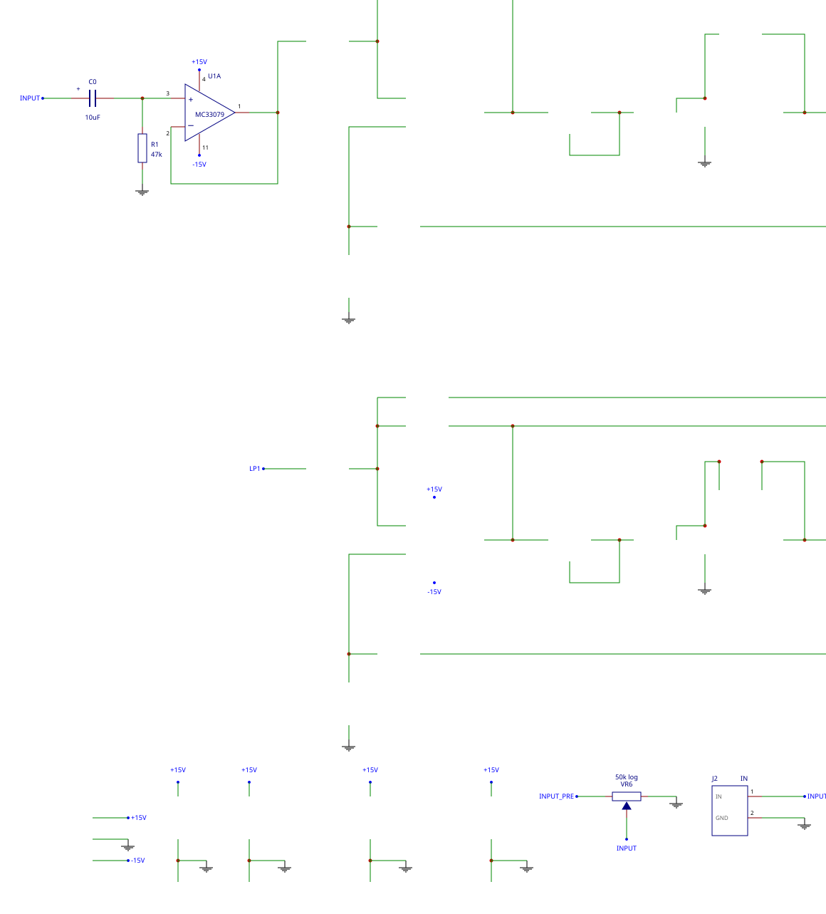
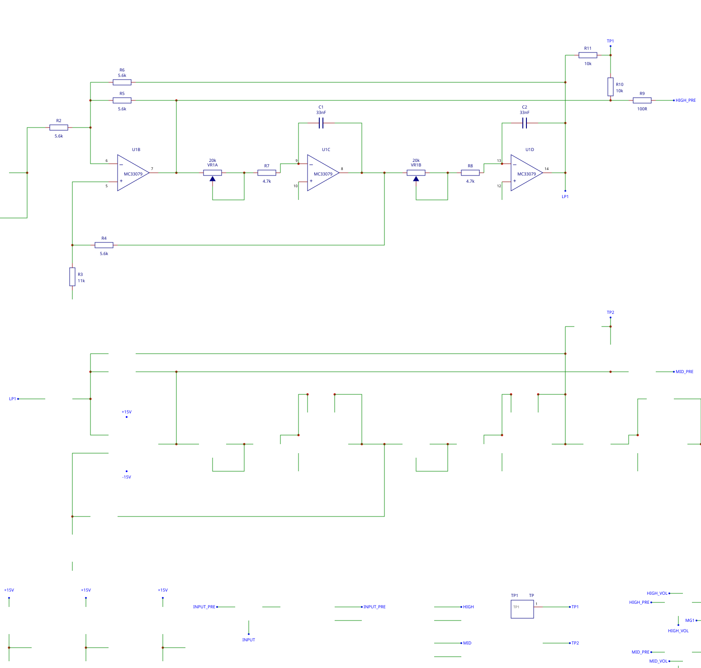
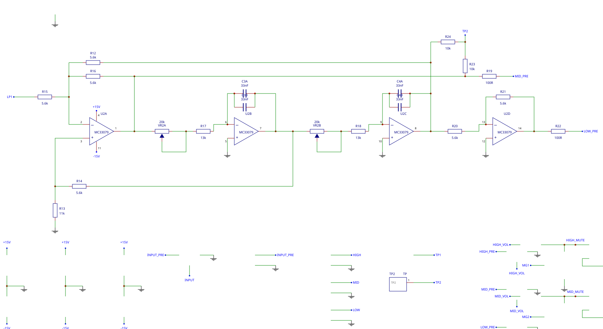
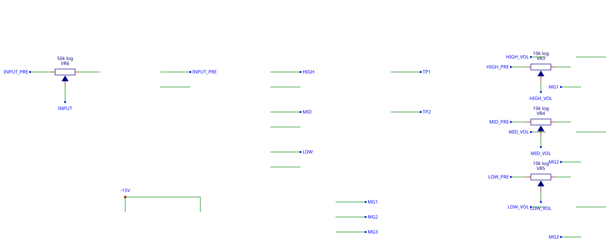
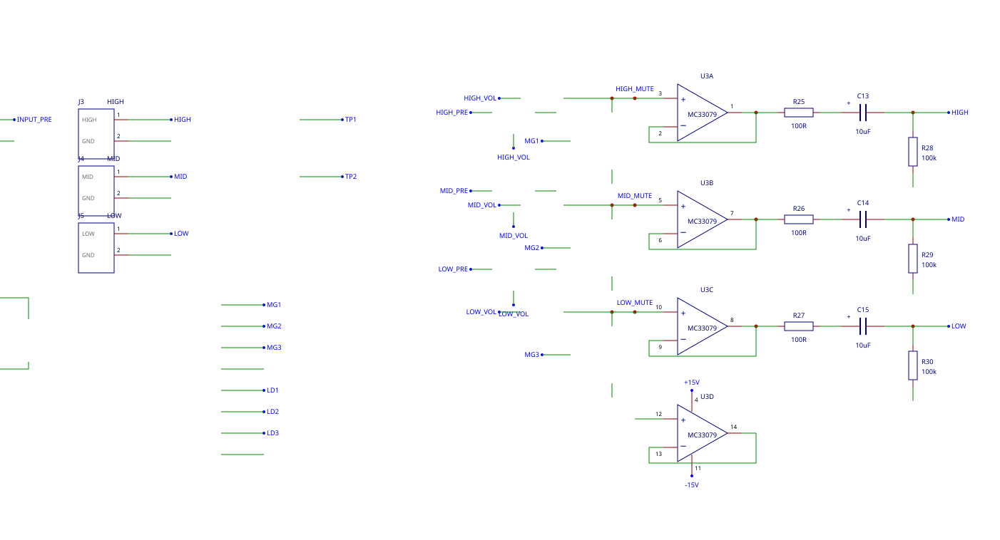
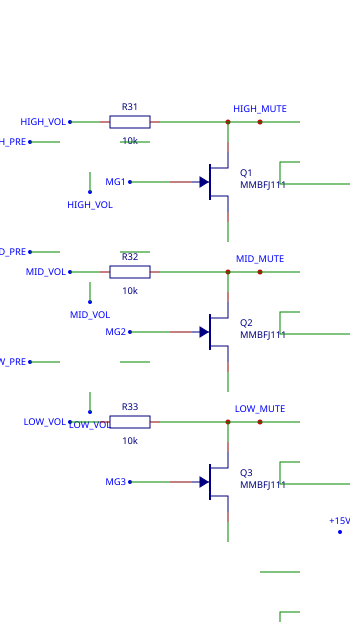
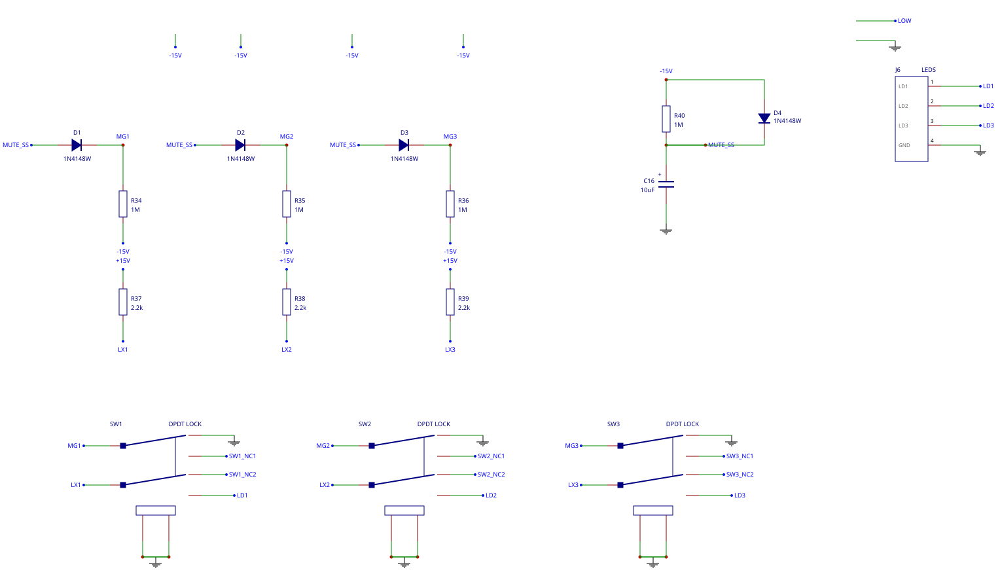
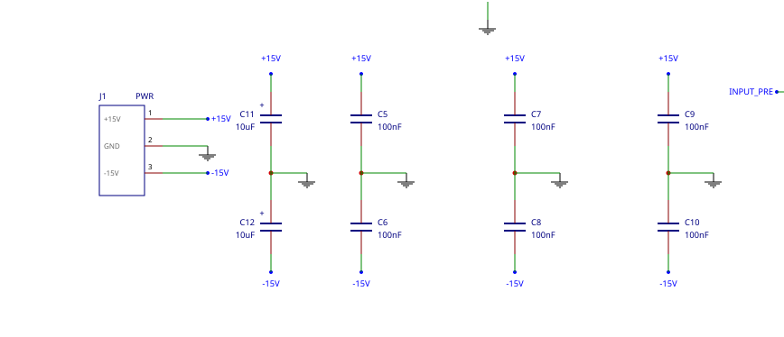

# Subcircuit diagrams

One diagram per functional block of the SMD board. They are **generated**,
not drawn: `tools/gen_schematic.py` crops each block out of the full sheet
through the same `render_svg()` the main schematic uses, so the symbols,
strokes and fonts are identical and cannot drift from it. Re-run
`python3 tools/gen_schematic.py` to rebuild them.

The part-by-part tables for each block are in
[`../circuit-notes.md`](../circuit-notes.md#function-blocks-on-the-smd-board);
these are the pictures.

## Input and master volume

The line input, the master volume ahead of everything, and the unity-gain buffer that drives the first filter.

## Crossover filter 1 - the HIGH / MID split

State-variable filter. `U1B`'s output IS the high-pass; `U1D`'s is the low-pass that feeds filter 2. `VR1` sets the split frequency.

## Crossover filter 2 - the MID / LOW split

The same topology again on filter 1's low-pass output, splitting it into MID and LOW. `U2D` inverts the bass output.

## Level controls

Master volume plus one trim per band, all passive attenuators after the filter and before the buffer.

## Output buffers and DC blocking

One unity-gain buffer per band, a build-out resistor, a DC blocking cap and a bleeder, into a terminal block with its own ground return.

## Muting - the shunt devices in the signal path

`Q1`-`Q3` shunt each buffer input to ground through `R31`-`R33`. Drawn here rather than with the rest of the mute circuit because this is where they sit electrically: across the buffer input.

## Muting - gate control, buttons and soft start

The gate pulldowns that unmute, the steering diodes that keep one button from muting all three bands, the `R40`/`C16` soft start that holds everything muted until the rails settle, and `SW1`-`SW3` themselves - the on-board latching buttons, one pole grounding the gate line and the other switching that band's LED feed out to `J6`.

## Power and decoupling

The supply terminal block, the bulk reservoir per rail, and a 100 nF bypass on each rail at each IC.

---

Free-standing text is left out of the crops on purpose. Section headings and
the sheet notes sit near a block but belong to no part, so a crop cannot
attribute them - and an adjacent block's heading landing on this diagram
would caption it with the wrong name.
