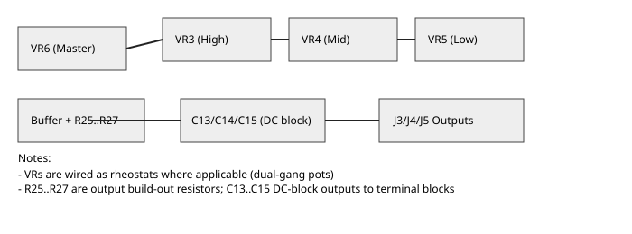

# Level (volume) pots

This document isolates the level controls (master + per-band volume pots).

Suggested parts to extract:

- `VR6` (master)
- `VR3`, `VR4`, `VR5` (per-band trims)
- `R25`, `R26`, `R27` (buffer build-out resistors)
- `C13`, `C14`, `C15` (output DC blocks)
- `J3`, `J4`, `J5` (output terminal blocks)

Extract command example:

```bash
python scripts/extract_subcircuit.py docs/netlist-esp-p148-3way-state-variable-crossover.json \
  --parts VR6,VR3,VR4,VR5,R25,R26,R27,C13,C14,C15,J3,J4,J5 \
  --out docs/subcircuits/levelpots_netlist.json
```

Notes:
- Import `levelpots_netlist.json` into your schematic viewer to render just the
  level-control portion of the circuit.
- If you want the pot bodies or layout hints, the schematic viewer will let you
  add them visually after importing the netlist.

## Diagram

Embedded simplified diagram (SVG):


